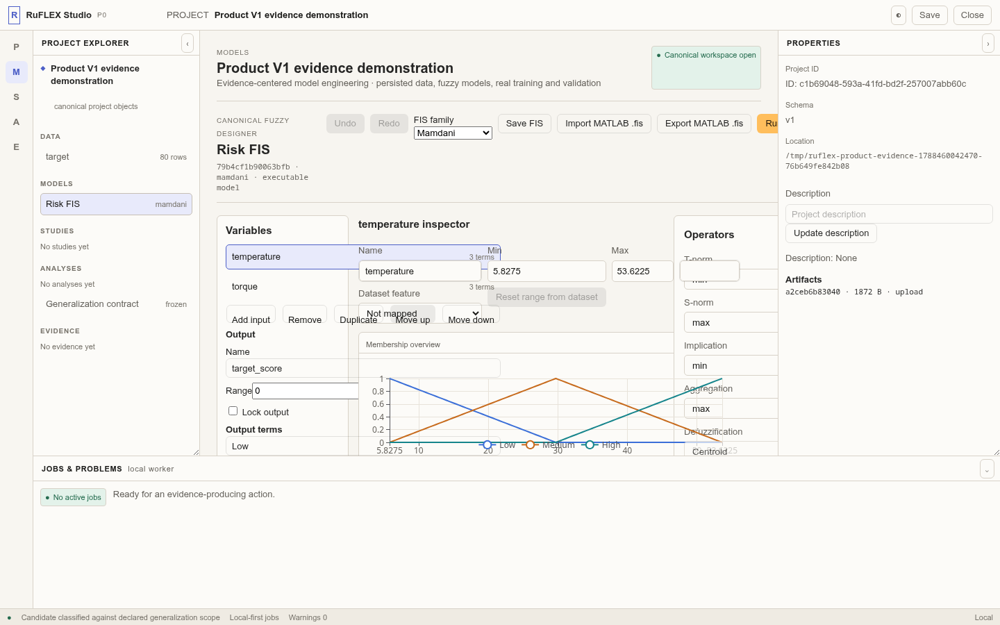
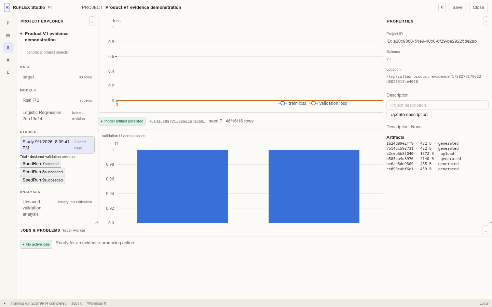
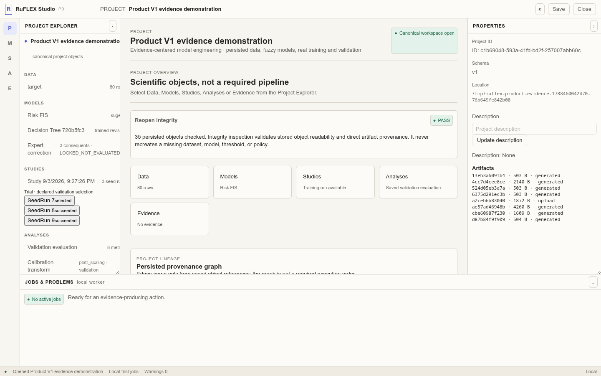

# RuFLEX

**RuFLEX is a local-first engineering Studio for building, inspecting and
auditing fuzzy, neuro-fuzzy and classical ML systems as persistent evidence
chains — not as a sequence of disposable notebook outputs.**

It is designed for the moment after a model has produced a metric: when a team
must still answer which data, preprocessing, model revision, validation rule,
explanation and policy produced that result, whether those objects can be
reopened, and what the result does *not* establish.

RuFLEX does not promise to solve underspecification, prove causal explanations,
guarantee generalization or turn a confidence score into a safety claim. It
makes the relevant product evidence explicit, linked and inspectable.

## Current release and research status

- **Product:** RuFLEX V1.0.1.
- **Product reference commit:** `8bbd46b2a349db88b98f8cbbbe95e18650c17569`.
  This identifies the inspected V1.0.1 product state; later documentation-only
  commits do not change its product subject or frozen research artifacts.
- **Stability Lab:** RC1 is complete; RC2 is complete and strengthens RC1 with
  explicit selected-run agreement and raw-threshold provenance.
- **Frozen studies:** Study 01 and Study 02 R2 are completed within their
  declared scopes. Their allowed and forbidden claims remain part of the
  corresponding research records.
- **A01:** its confirmatory final result is frozen. It is not a pre-freeze
  plan: 300 fixed fits across 15 dataset/model cells yielded one
  `SUPPORTS_H3`, one `CONTRADICTS_H3`, and 13 `INCONCLUSIVE` H3 outcomes.

For a compact technical passport and links to the frozen evidence, see
[Current state](docs/CURRENT_STATE.md).

## The position

Most model workflows end with a trained artifact and a chart. RuFLEX treats a
model result as a network of independently inspectable objects:

```text
DatasetContract
  └─ train-only preprocessing ── TrainingRun ── Validation Evaluation
                                      │                 │
                                      │                 ├─ calibration / threshold / review policy
                                      │                 ├─ post-hoc explanation / checks
                                      │                 └─ Stability Lab evidence
                                      │
                                      ├─ exact FIS revision / trace where applicable
                                      └─ Lineage ── AssuranceCase ── VerificationBundle
```

The implementation is deliberately local and object-centred:

```text
React + TypeScript Studio
            │
            ▼
FastAPI application boundary
            │
            ▼
Canonical persisted Python domain objects
```

The Studio is the product surface. The API, read-only SDK and exported bundle
all expose the same persisted evidence rather than parallel, incompatible
representations.

## What a user can do today

- Confirm a CSV/XLSX `DatasetContract` with explicit target, roles, row
  identity, source artifact and audit evidence.
- Design and revise Type-1 Mamdani or Sugeno FIS models; import/export the
  supported MATLAB `.fis` subset with source-artifact provenance.
- Run real FlatNeuroFuzzy/ANFIS, logistic/linear, Decision Tree, Random Forest
  and Gradient Boosting training, each bound to an immutable train-only
  preprocessing artifact.
- Persist validation evaluations, raw operating curves, calibration evidence,
  class thresholds and selective `ACCEPT`/`REVIEW` policies without opening the
  final test early.
- Run fixed-split multi-seed Studies and inspect aggregate variability,
  case-level agreement, high-confidence instability and a frozen
  validation-derived Stability Gate.
- Keep exact fuzzy execution traces separate from post-hoc attribution; create
  compatible Occlusion, Integrated Gradients, GradientSHAP, permutation SHAP
  and TreeSHAP evidence with explicit applicability and replay checks.
- Declare scope, inspect slices, execute revision-bound BehaviorSpecs, inspect
  finite Decision Tree paths, and record TRAIN-only expert FIS correction.
- Follow all of this through Lineage, independent AssuranceCase gates and a
  portable, inspection-first VerificationBundle.

## Scientific and operational boundaries

RuFLEX encodes workflow boundaries instead of relying on an informal promise:

```text
TRAIN       fits preprocessing and model parameters
VALIDATION  selects models, thresholds, calibration and review policies
TEST        remains closed until an already frozen policy is applied once
```

Key safeguards are concrete rather than rhetorical:

- content-addressed data, model and preprocessing artifacts are verified with
  their metadata receipts on reopen;
- FIS revisions, imported source artifacts, explanation contracts and
  explanation checks fail integrity inspection when their persisted bindings
  are malformed or detached;
- a final-test evaluation binds the exact frozen policy identities and blocks
  post-unlock training, threshold/policy fitting and retuning;
- Stability Lab distinguishes `TRAINING_VARIABILITY`, `SPLIT_VARIABILITY` and
  `COMBINED_VARIABILITY`. Only a fixed split supports fully matched
  case-level agreement and HCIR; the other modes are labelled rather than
  silently interpreted as isolated training randomness;
- post-hoc attribution is never labelled as an exact computation trace or
  causal proof;
- AssuranceCase presents separate evidence gates, assumptions, limitations and
  risks — never a scalar “trust score”.

## Research status

RuFLEX currently hosts three related, but distinct, research directions:

- **Exact fuzzy computation and trace reconstruction:** declared fuzzy
  semantics can be reconstructed and inspected where the product route supports
  an exact trace.
- **Validation–final-test artifact separation:** persisted objects and product
  interfaces are tested for the declared boundary; this is not a universal
  leakage detector or a certification claim.
- **Stability-aware selective review:** repeated fixed-split fits make selected
  prediction support, dispersion and review decisions measurable with
  validation-derived criteria.

A01 is the frozen confirmatory study for the third direction. Its 300 fixed
fits cover 15 dataset/model cells. One cell favoured the frozen stability-aware
review policy over its validation-matched confidence-only comparator, one
favoured the comparator, and 13 were inconclusive. This is model- and
data-dependent evidence, not a claim that RuFLEX universally reduces risk.

## Product evidence, not a slide deck

The repository contains 19 tracked screenshots generated from one real,
persisted React Studio route. The capture creates the project, trains models,
saves policies and evidence, closes/reopens it, then writes the screenshots.
It fails if a required route cannot be exercised.

- [Evidence manifest](docs/product/PRODUCT_V1_EVIDENCE_MANIFEST.md) maps every
  screenshot to its persisted objects, claim boundary and E2E coverage.
- [Product demonstration](docs/product/PRODUCT_V1_DEMONSTRATION.md) narrates
  the captured path without promoting it to a benchmark result.
- `frontend/e2e/product-evidence-capture.spec.ts` is the executable capture
  route; `docs/product/screenshots/` contains all 19 generated images.

Representative views:







These images prove the captured product route and its persisted objects. They
do not prove field accuracy, universal stability, causal validity or safe
deployment in every domain.

## Run the Studio

RuFLEX requires Python 3.11+ and Node.js for the Studio.

```bash
python -m venv .venv
.venv/bin/python -m pip install -U pip
.venv/bin/python -m pip install -e '.[dev,studio]'
```

Start the API from the repository root:

```bash
PYTHONPATH=src .venv/bin/python -m uvicorn ruflex.api.main:app --host 127.0.0.1 --port 8010
```

In another terminal:

```bash
cd frontend
npm ci
VITE_RUFLEX_API_URL=http://127.0.0.1:8010 npm run dev
```

Open the Vite address shown in the terminal (normally
`http://127.0.0.1:5173`).

## Verify the product route

```bash
# backend
PYTHONPATH=src .venv/bin/python -m pytest -q
PYTHONPATH=src .venv/bin/python -m compileall -q src

# Studio
cd frontend
npm test
npm run build
npm run build-storybook
PLAYWRIGHT_BROWSERS_PATH=../.playwright-browsers npx playwright test
```

For a fresh tracked-source handoff, use `git archive`; the release QA receipts
and source archives intentionally exclude local project stores, model binaries,
raw datasets, credentials and caches.

## Reproducibility

Protocols, frozen configurations, result artifacts and limitations are retained
under `research/`; product evidence and technical notes live under `docs/`.
The V1.0.1 tracked-source checkpoint is
`RuFLEX_PRODUCT_V1_0_1_SOURCE_8bbd46b.zip` with SHA-256
`382e06f3aab0689269498b14bf8496bf15dabeac62bbe691c5aef323ab0cd28c`.

Stability Lab RC1 and RC2 are historical release checkpoints, not separate
products. Their receipts document the state at their respective freezes; the
current status is maintained in this README and
[Current state](docs/CURRENT_STATE.md).

## Read-only Python access

The SDK is an inspection boundary, not a hidden mutation path:

```python
from ruflex.sdk import open_studio_project

project = open_studio_project("/path/to/project")
print(project.dataset_contract())
print(project.training_runs())
print(project.lineage())
print(project.stability_analyses())
```

See [Python access](docs/PYTHON_ACCESS.md) for the available persisted objects.

## Repository guide

```text
frontend/    React/TypeScript RuFLEX Studio
src/ruflex/  canonical domain, application services, FastAPI and SDK
src/ruanfis/ vendored deep neuro-fuzzy backend
tests/       product, persistence, integrity and browser-route tests
docs/product/ product evidence, demonstration and technical notes
research/    protocols, frozen configurations, result artifacts and limitations
```

`src/ruanfis` is a vendored backend boundary. RuFLEX owns the project model,
persistence, workflow, Studio, evidence semantics and verification paths around
it. Older toolbox, Streamlit-oriented and article-oriented material is retained
only for compatibility or historical research context; it is not the Product
V1 entrypoint.

## Product and research

Product and research are distinct layers of the same RuFLEX platform, not
separate projects. Product capabilities provide the persisted environment in
which studies run; frozen studies provide empirical evidence within a declared
scope. A study does not make a product feature exist, and a product feature
does not establish an empirical claim by itself.

## License

See [LICENSE](LICENSE).
